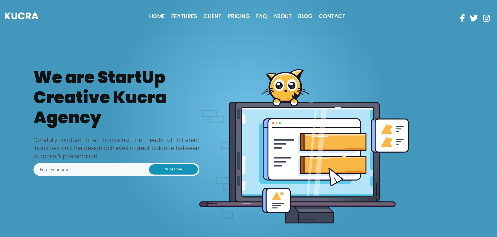
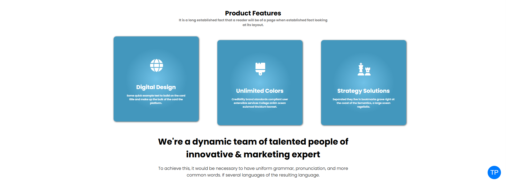
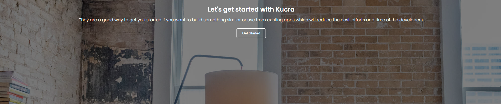
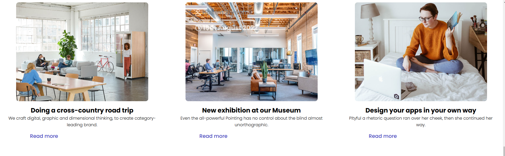
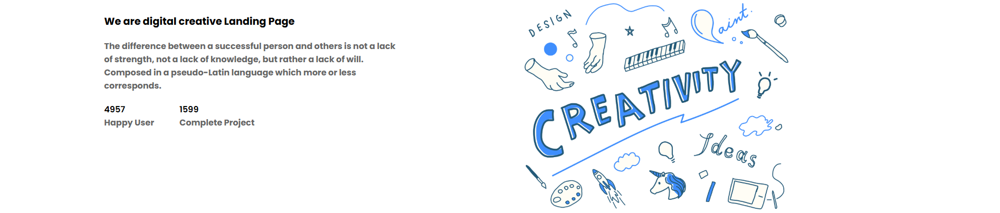
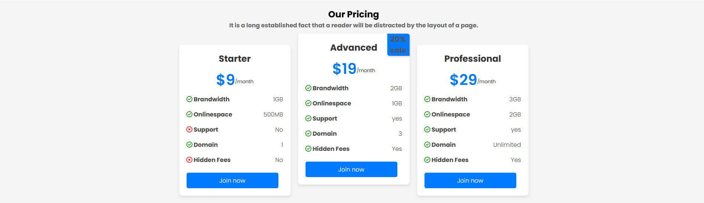
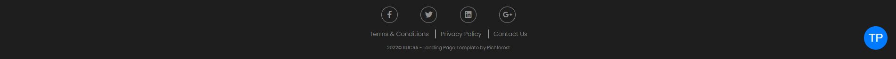

# 🎉 Landing Page - Votre Porte d'entrée Vers l'Excellence 🌟

Bienvenue dans ce projet captivant qui vous guidera dans la création d'une **Landing Page dynamique et moderne** en HTML, CSS, et JavaScript. 🚀 Avec des interactions engageantes et un design raffiné, ce projet est une opportunité parfaite pour perfectionner vos compétences front-end tout en explorant les dernières tendances en matière de développement web.

---

## 🛠️ Fonctionnalités Clés

### 🖼️ I. Premières Sections
- **Section immersive :** La première section occupe toute la hauteur de l'écran pour une expérience visuelle saisissante.
- **Newsletter interactive :** Un champ éditable pour la souscription à la newsletter.
- **Effets au survol :**
  - Les liens de la barre de navigation et le bouton "Subscribe" s'animent élégamment au passage de la souris.
- **Cartes animées :** Les cartes de la deuxième section se déplacent subtilement lors du survol pour attirer l'attention.
- **Style typographique :** Utilisation de la police moderne *Poppins* (Google Fonts).
- **Icônes expressives :** Intégration des icônes via *Font Awesome*.

### 👫 II. Section Équipe
- **Mettez vos talents en avant :**
  - Effet de zoom au survol.
  - Transition du noir et blanc à la couleur.
  - Apparition des icônes de réseaux sociaux (Facebook, Twitter, Skype).

### 🏔️ III. Parallax
- **Effet Parallax :** Une section immersive avec un effet visuel fluide.
- **Bouton "Get Started" :** Animation subtile et engageante au survol.

### 📝 IV. Blog
- **Articles stylisés :** Au survol, l'image d'entête s'assombrit, révélant l'auteur et la date de publication.

### 💰 V. Pricing
- **Section Tarifs :** Présentation claire et élégante des prix et abonnements.

### 🌍 VI. Footer
- **Un pied de page pratique et soigné :** Inclus les liens essentiels et les informations de contact.

### ⬆️ VII. Scroll to Top
- **Bouton Retour en haut :** Toujours visible en bas à droite, ce bouton fixe permet de revenir rapidement au début de la page.

---

## 🌈 Points Techniques

1. **Variables CSS globales :**
   - Centralisation des couleurs et tailles via `:root` pour une maintenance simplifiée.
   - Exemples : couleurs du dégradé radial, marges, polices.

2. **Unités optimisées :**
   - Utilisation de *rem*, *em*, et *vh/vw* pour garantir un design responsive.

3. **Effets CSS dynamiques :**
   - Utilisation de `transform`, `transition`, et `filter` pour des animations fluides.

4. **Plugins et ressources externes :**
   - Google Fonts (Poppins)
   - Font Awesome pour les icônes

